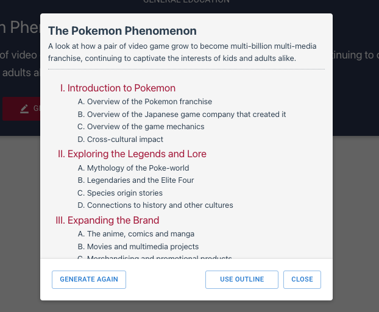
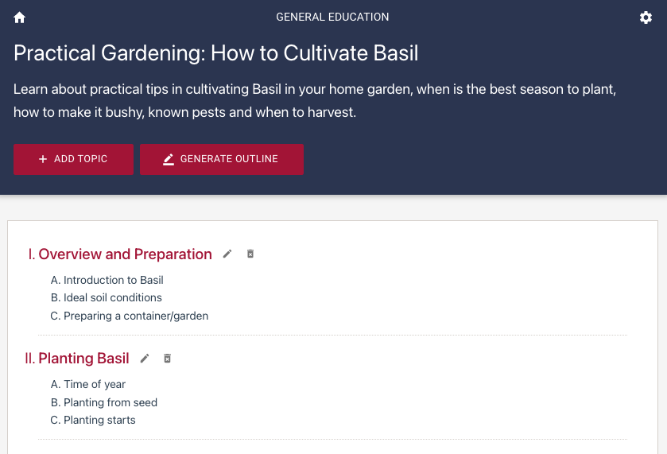
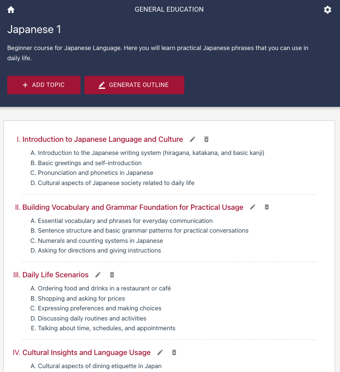
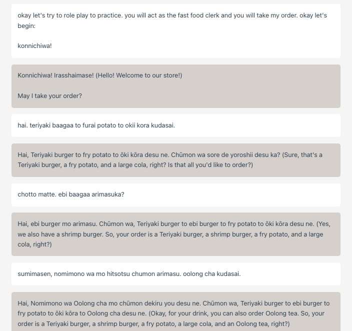

chatgpt-learning-app
======

This sample React app aims to be a learning hub that aids students in their studies. By providing topics from their actual course syllabus, users can interact with the AI chatbot tutor and engage in dynamic conversations related to the topics. They can ask questions, explore concepts, and receive detailed explanations. Additionally, they can generate quizzes to test their knowledge of the topic.

The application is built using Next.js 13, powered by the OpenAI API, and supports Japanese language settings (日本語対応).

---

このサンプルのReactアプリは、学生の学習を支援する学習ハブを目指しています。実際のコースシラバスからトピックを提供することで、ユーザーはAIチャットボットチューターと対話し、トピックに関連するダイナミックな会話に参加することができます。質問をしたり、概念を探求したり、詳細な説明を受けたりすることができます。さらに、トピックの知識をテストするためにクイズを生成することもできます。

このアプリケーションは、Next.js 13を使用して構築されており、OpenAI APIで動作しており、日本語の言語設定に対応しています。


# Application


To add a subject, simply click on the "Add Subject" button.
Enter the subject name and provide a concise description.


On the Subject page, you can add the topic outline by clicking the "Add Topic" button.
If you are using an academic subject, you can copy the items from your syllabus.

You can also generate the topic outline automatically by clicking the "Generate Outline" button. Ensure that the subject name and description are accurate and descriptive. You can edit the topics later after adding them.



You can add any subject you can think of, in addition to your academic subjects. Just use the auto-generation feature for the topic outline.



Click on the topic title to go to the Topic page.
On the Topic page, you can discuss the selected topic with the chatbot or generate and take a Quiz.


Test your knowledge of the topic on the Quiz page.
You will be presented with 10 multiple-choice questions.
If you have completed the previous quiz or are having difficulty answering, you can generate a new quiz.


# Sample Subject

Here is a sample subject, for example, you want to learn practical Japanese.



In the discussion page, you can ask the chatbot tutor basically anything related to the topic and do role play, etc.




# Setup

Clone the repository and install the dependencies

```sh
git clone https://github.com/supershaneski/chatgpt-learning-app.git myproject

cd myproject

npm install
```

Copy `.env.example` and rename it to `.env` then edit the `OPENAI_APIKEY` and use your own `OpenAI API key`.

```javascript
OPENAI_APIKEY=YOUR_OWN_API_KEY
```

Then run the app

```sh
npm run dev
```

Open your browser to `http://localhost:3008/` to load the application page.

