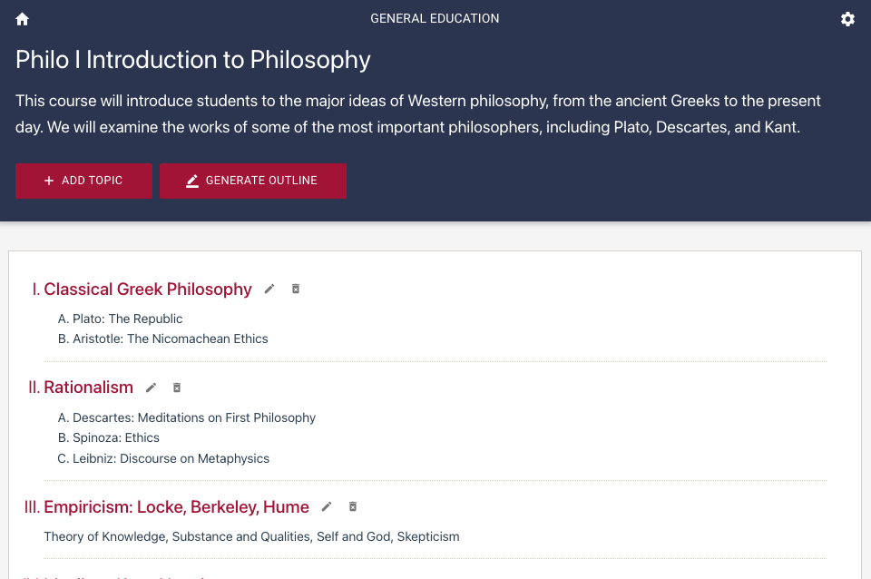

chatgpt-learning-app
======

A sample React application built with Next.js 13 and powered by the OpenAI Chat API. 

The application supports Japanese language settings. (日本語対応)


# Description

This sample app aims to be a learning hub to aid students in their subjects.
By providing topics from their actual course syllabus, the user can interact with the AI chatbot tutor and enagage in dynamic conversations related to the topics. Ask questions, explore concepts and receive detailed explanations. 
Generate Quiz to test your knowledge of the topic. User can learn at their own pace using this app.


# Application

From the landing page, you can add your subjects. 
Provide the subject name and a brief description of the subject.
You can practically add any subject aside from academic subjects.


When you click on a particular subject, you will be directed to the Subject page.
Here, you will add the Topics for the selected subject.
Use the course syllabus provided by your actual subject for the list of topics.



When you click a particular topic, you will be redirected to the Topic page. Here, you can discuss the topic with the AI chatbot or test your skill by generating Quiz.


Test your knowledge of the topic in the Quiz page.
You will be given 10 multiple-choice questions.
You can regenerate new Quiz if you already completed the previous one or having difficulty answering.


# Stack

* [Next.js 13](https://nextjs.org/docs/getting-started/installation), the React framework, latest version

  Manual installation

  ```sh
  $ npm install next@latest react@latest react-dom@latest
  ```

* [Storybook](https://storybook.js.org/recipes/next), components workshop 

  ```sh
  $ npx storybook@latest init
  ```

* [Material UI](npm install @mui/material @emotion/react @emotion/styled
), React components library

  ```sh
  $ npm install @mui/material @emotion/react @emotion/styled
  ```

  Roboto font

  ```sh
  $ npm install @fontsource/roboto
  ```

  Icons

  ```sh
  $ npm install @mui/icons-material
  ```

* [Zustand](https://github.com/pmndrs/zustand), global app state management and also using the [persisting store data](https://docs.pmnd.rs/zustand/integrations/persisting-store-data) as simple database

  ```sh
  $ npm install zustand
  ```

* [OpenAI](https://github.com/openai/openai-node#readme), OpenAI Node.JS library to access OpenAI APIs
  
  ```sh
  $ npm install openai
  ```

# Setup

Clone the repository and install the dependencies

```sh
git clone https://github.com/supershaneski/chatgpt-learning-app.git myproject

cd myproject

npm install
```

Copy `.env.example` and rename it to `.env` then edit the `OPENAI_APIKEY` and use your own `OpenAI API key`.

```javascript
OPENAI_APIKEY=YOUR_OWN_API_KEY
```

Then run the app

```sh
npm run dev
```

Open your browser to `http://localhost:3008/` to load the application page.

